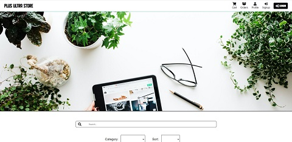

# E-commerce App

E-commerce App is a two-part Codecademy portfolio project on the Full-Stack Engineer career path, in which we were instructed to problem solve and utilize developer resources to build the backend and frontend of an e-commerce store.

## Server-side Project Objectives
For part one of the project, we were tasked with building an e-commerce application REST API using our knowledge of server-side web development. The project required that we build an e-commerce application REST API that allows users to perform various CRUD operations such as registering an account, browsing products for sale, and included the following:

- Build a functioning e-commerce REST API using Express, Node.js, and Postgres
- Set up an Express server
- Set up Git version control
- Design the database
- Create PostgreSQL database and tables
- Connect the app and database
- Plan API endpoints
- Set up user registration
- Set up local login
- Set up user endpoints and add the logic for handling CRUD operations on user accounts
- Set up product endpoints and add the logic for handling CRUD operations on products
- Set up cart endpoint and add the logic for handling CRUD operations on user carts
- Set up checkout endpoint and add the logic for handling checkout
- Set up order endpoints and add the logic for handling CRUD operations on orders
- Document the API by adding and configuring Swagger

## Client-side Project Objectives
For part two of the project, we were instructed to continue building an e-commerce application using our knowledge of full-stack web development. The project required that we build a fully-functioning e-commerce application that allows users to register and complete a purchase, and included the following:

- Build a functioning e-commerce application using React, Node.js, and Postgres by extending our existing e-commerce REST API with an interactive client
- Set up the React project
- Set up React Router
- Enable session support
- Build the login page
- Set up third party-login and enable users to create an account with a third-party service such as Google, Facebook, etc
- Build the registration page and enable users to create a personal account
- Add logout functionality
- Build the products listing page and enable users to browse products
- Build the products details page
- Track cart items
- Build the checkout flow and enable users to complete a purchase using a payment processor (Stripe recommended)
- Set up order history and enable users to view order history
- Allow access to protected resources only after the user logs in
- Publish the application to Heroku (originally published on Heroku, has since been redeployed on Google Cloud)

## Table of Contents

- [Features](#features)
- [Technologies](#technologies)
- [Screenshots](#screenshots)
- [Future Work](#future_work)
- [Status](#status)

## Features

I chose to implement the E-commerce Store application utilizing React and Redux, and added a few additonal features as well. The home page was created with a large hero section with a user interactive slideshow. The products returned by the database can be filtered using the category filters and/or by search terms. Orders can be canceled as long as they are in processing status and the order history can also be sorted by date. Under the user's profile there is a change password option. Third-party registration and authentication was implemented utilizing Google, and the recommended Stripe payment processor functionality was added. I integrated error states into each component with custom error messages passed from the server. Lastly, I created an animated product loader component and a spinning loader that I utilized for loading states throughout the app. The application has responsive layout changes for all device types and is deployed via Google Cloud and CapRover at [Plus Ultra Store](https://e-commerce-app.projects.mycodefolio.com/).

## Technologies

Frontend:

- JavaScript ES6
- React: 17.0.2
- React Redux: 7.2.6
- React Router: 6.2.1
- Redux Toolkit: 1.7.1
- Axios: 0.25.0
- Stripe: 1.25.0
- React Stripe: 1.7.0

Backend:

- JavaScript ES6
- Node: 16.14.0
- Bcrypt: 5.0.1
- Body Parser: 1.19.0
- Connect Pg Simple: 7.0.0
- Cookie Parser: 1.4.5
- Cors: 2.8.5
- Dotenv: 10.0.0
- Express: 4.17.1
- Express Session: 1.17.2
- Morgan: 1.10.0
- Nodemon: 2.0.14
- Passport: 0.5.0
- Passport Google Oauth2: 2.0.0
- Passport Local: 1.0.0
- Pg: 8.7.1
- Stripe: 8.213.0
- Swagger UI Express: 4.3.0
- Uuid: 8.3.2

## Screenshots

## Future Work

- Implement a JWT token-based authentication approach.
- Add email password reset ability and functionality.

## Status

This project is in progress.